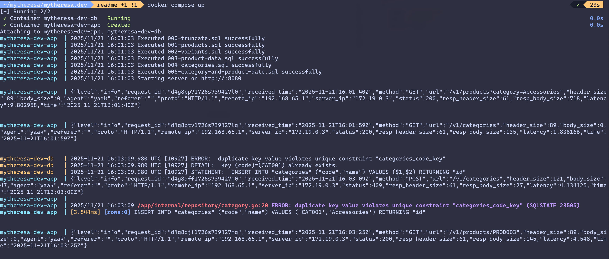

# README

## Project Structure

```
├── cmd                     # Application entrypoints (binaries)
│   ├── server              # Main HTTP API server (main.go, wiring, startup)
│   └── seed                # CLI tool to seed the database with initial data
├── internal                # Private application code (not exposed as a module)
│   ├── app                 # Core application/business logic
│   │   ├── category        # Category use-cases/handlers/services
│   │   └── product         # Product use-cases/handlers/services
│   ├── router              # HTTP routing setup
│   │   ├── middleware      # Shared HTTP middleware (logging, conntext typing, etc.)
│   │   └── router.go       # Router initialization and route registration
│   ├── config              # Configuration loading and environment handling
│   ├── errors              # Centralized error types and error handling helpers
│   ├── model               # Domain models/entities
│   │   ├── category.go     # Category model definition
│   │   ├── product.go      # Product model definition
│   │   └── variant.go      # Product variant model definition
│   ├── repository          # Data access layer (database persistence)
│   │   ├── category.go     # Category repository implementation
│   │   └── product.go      # Product repository implementation
│   └── util                # Shared utilities/helpers
├── sql                     # Database migrations and SQL scripts
├── Dockerfile              # Docker image build definition for the app
├── compose.yml             # Docker Compose setup for local infrastructure
├── bin                     # Local tooling binaries used by the project
│   ├── gofumpt             # Code formatter
│   ├── govulncheck         # Go vulnerability scanner
│   ├── staticcheck         # Advanced static analysis tool
│   └── swag                # Swagger/OpenAPI generator CLI
└── swagger.yaml            # OpenAPI/Swagger specification for the HTTP API
```

💡 [swaggo/swag](https://github.com/swaggo/swag) : `swag init -g cmd/server/main.go -o . -ot yaml --parseDependency --parseInternal `

## Setup dev environment

- Install [Docker Application](https://www.docker.com/products/docker-desktop) in the development environment.
- `cd path/to/dumindu/mytheresa && docker-compose build && docker-compose up`

### Install dev dependencies

- Install [Go](https://go.dev/dl/).
- [Set `GOPATH`](https://github.com/golang/go/wiki/SettingGOPATH#setting-gopath) and `GOPATH\bin` (
  Linux/macOS: `export PATH=$PATH:$GOPATH/bin`)
- `go install github.com/swaggo/swag/cmd/swag@latest`
- `go install mvdan.cc/gofumpt@latest`
- `go install honnef.co/go/tools/cmd/staticcheck@latest`
- `go install golang.org/x/vuln/cmd/govulncheck@latest`


> This repository contains a Go application for managing products and their prices, including functionalities for CRUD operations and seeding the database with initial data.


